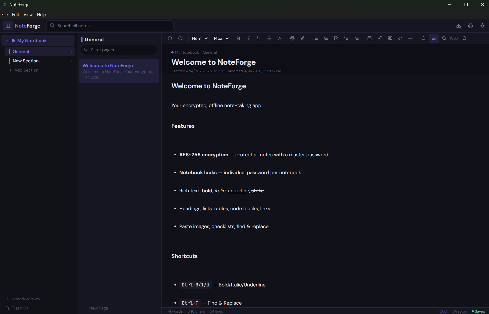

# NoteForge

**Encrypted, offline note-taking.** A three-panel, OneNote-style app that keeps your data local and protected with AES-256-GCM encryption.

## Features

- **3-panel layout** — Notebooks → Sections → Pages, just like OneNote.
- **AES-256-GCM encryption** — Master password encrypts all data at rest, with scrypt key derivation (N=65536, r=8, p=1).
- **Per-notebook locks** — Individual password for sensitive notebooks, on top of the master.
- **Fully offline** — All fonts, scripts, and dependencies are bundled in `lib/`. The only network request is an optional update check against GitHub Releases on launch.
- **Rich text editor** — Bold, italic, headings, lists, tables, code blocks, links, images, checklists.
- **Find & Replace** — Safe text-node walking that won't break HTML.
- **Auto-lock** — Configurable idle timeout (5 / 15 / 30 / 60 min) plus `Ctrl+L` manual lock.
- **Encrypted backup** — Export and restore `.enc` backup files.
- **Auto-update** — Checks GitHub Releases on launch and prompts to download and install when a new version is available. Can be disabled in settings.
- **Dark & light themes** — Persisted across sessions.
- **Export** — HTML and plain text, with warnings before writing unencrypted output.

## Screenshot



## Install

### Download (Windows)

Grab the latest installer from [Releases](../../releases):

- **`NoteForge Setup x.x.x.exe`** — Standard Windows installer (recommended).
- **`NoteForge-x.x.x-portable.exe`** — Portable, no install needed.

Releases are built automatically by GitHub Actions — no manual build step on my end.

> **Note:** Windows will show a SmartScreen warning because the app isn't code-signed yet. Click **"More info"** → **"Run anyway"** to proceed. The source is fully open for inspection.

### Build from source

Requires [Node.js](https://nodejs.org/) 20 LTS or 22 LTS. Node 22 is recommended (Electron's `@electron/*` packages are moving to Node 22 as the new minimum).

```bash
git clone https://github.com/jamesccupps/NoteForge.git
cd NoteForge
npm install
npm run build:jsx
npm start
```

To build the installer locally (or use `Build.bat` on Windows):

```bash
npm run dist
```

Output goes to `dist/`.

## Security

This app exists specifically to keep notes private, so it's worth being specific about how.

### Encryption

| Layer | Algorithm | Key derivation |
|---|---|---|
| Master (file-level) | AES-256-GCM | scrypt N=65536, r=8, p=1 |
| Notebook locks | AES-256-GCM | scrypt N=65536, r=8, p=1 |

- Master password is **never stored** — only the derived key (`Buffer`) lives in memory during the session.
- Notebook passwords are **never held in the renderer** — after unlock, the renderer only has an opaque 128-bit handle to a session key that lives in the main process.
- Session keys are zeroed with `Buffer.fill(0)` on lock, close, and idle timeout.
- Locked notebook sections are **stripped from disk on every write** via `sanitizeForDiskSync()` in the renderer, with a second-layer `sanitizeDataJson()` safety net in the main process. Plaintext never reaches the data file even if the renderer is compromised.
- **KDF downgrade protection** — decrypt rejects blobs with `N < 16384`, non-power-of-2 `N`, or malformed fields, so an attacker who can write the data file can't weaken the encryption header and then have you type your password into a weakened blob.
- Rate limiting with exponential backoff on failed password attempts, persisted across restarts, with separate counters for master unlock and notebook unlock.
- Password strength enforcement: minimum 10 characters, at least 3 of 4 character classes (upper / lower / digit / symbol), dictionary check against 160 common passwords, and a low-entropy check that rejects passwords with fewer than 5 unique characters.

### Content Security Policy (renderer)

```
default-src 'none';
script-src 'self';
style-src 'self' 'unsafe-inline';
font-src 'self';
img-src 'self' data:;
connect-src 'none';
```

All scripts and fonts load from the local `lib/` directory. Zero CDN dependencies at runtime. `connect-src 'none'` blocks any outbound fetch or XHR from the renderer, even if code is injected.

The auto-updater runs in the main process — not governed by the renderer's CSP — and makes a single HTTPS request to GitHub Releases on launch to check for new versions. Disable it in File → Settings if that matters to you.

### Additional hardening

- DOMPurify sanitizes all note content on load, paste, and export.
- Navigation guards block all non-`file://` navigation. `will-navigate` and `will-redirect` are both handled, and `setWindowOpenHandler` denies every attempt to open a new window.
- `contextIsolation: true`, `nodeIntegration: false`.
- All runtime permission requests denied — `setPermissionRequestHandler` returns `false` for every permission.
- DevTools menu item is removed from production builds.
- Export dialogs distinguish between generic unencrypted export and export from a password-protected notebook.
- Print dialogs show a warning when printing from a password-protected notebook.
- Backup restore validates `v=2`, `kdf=scrypt`, and `N>=16384` before accepting anything.
- Password hint inclusion in backups is opt-in via an explicit dialog. Default is exclude.
- Config keys are allowlisted — the renderer can only write a tiny whitelist of known settings.
- CI actions are pinned to commit SHAs so supply-chain attacks via tag-moves can't affect the build.

Security issues? See [SECURITY.md](SECURITY.md) for responsible disclosure.

## Development

### File structure

```
NoteForge/
├── .github/
│   ├── ISSUE_TEMPLATE/       # Bug report and feature request templates
│   ├── pull_request_template.md
│   └── workflows/
│       └── build.yml         # CI: auto-build and release on tag push
├── docs/
│   ├── CONTRIBUTING.md
│   └── screenshots/
├── app.jsx            # React source (edit this)
├── app.js             # Compiled output (generated)
├── main.js            # Electron main process + crypto
├── preload.js         # IPC bridge (contextBridge)
├── index.html         # Shell with CSP
├── styles.css         # All styling + @font-face
├── package.json       # Scripts + electron-builder config
├── package-lock.json  # Pinned dependency graph (committed for reproducibility)
├── lib/               # Bundled runtime dependencies
│   ├── react.min.js
│   ├── react-dom.min.js
│   ├── purify.min.js
│   └── *.woff2        # DM Sans + JetBrains Mono fonts
├── assets/
│   ├── icon.ico
│   └── icon.png
├── Build.bat          # Windows build helper
├── NoteForge.bat      # Windows dev launcher
├── CHANGELOG.md
├── SECURITY.md
├── LICENSE
└── README.md
```

### Workflow

1. Edit `app.jsx` (React/JSX source).
2. Compile: `npm run build:jsx`.
3. Test: `npm start`.
4. Build installer: `npm run dist`.

### Data location

| OS | Path |
|---|---|
| Windows | `%APPDATA%\noteforge\` |
| macOS | `~/Library/Application Support/noteforge/` |
| Linux | `~/.config/noteforge/` |

Files written: `noteforge-data.json` (unencrypted) or `noteforge-data.enc` (encrypted), `noteforge-config.json`, `window-state.json`, `ratelimit.json`, and `noteforge-hint.txt` (optional password hint).

## Keyboard shortcuts

| Shortcut | Action |
|---|---|
| `Ctrl+N` | New Page |
| `Ctrl+Shift+N` | New Notebook |
| `Ctrl+B` / `I` / `U` | Bold / Italic / Underline |
| `Ctrl+D` | Duplicate Page |
| `Ctrl+F` | Find & Replace |
| `Ctrl+L` | Lock App |
| `Ctrl+Z` / `Ctrl+Y` | Undo / Redo |
| `Ctrl+=` / `Ctrl+-` | Zoom In / Out |
| `Ctrl+\` | Toggle Sidebar |
| `Ctrl+Shift+D` | Toggle Theme |
| `Ctrl+P` | Print |
| `Ctrl+Shift+E` | Export HTML |

## Contributing

See [docs/CONTRIBUTING.md](docs/CONTRIBUTING.md).

## Contact

Open an [issue](https://github.com/jamesccupps/NoteForge/issues) for bugs and feature requests. For security reports or general questions, email <jamesccupps@proton.me>.

## Changelog

See [CHANGELOG.md](CHANGELOG.md).

## License

[MIT](LICENSE) — James Cupps
