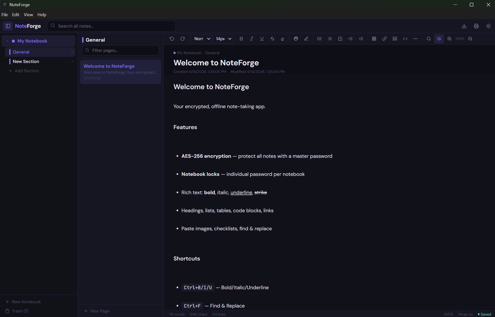

# NoteForge

**Encrypted, offline note-taking.** A OneNote-style app that keeps your data local and protected with AES-256-GCM encryption.

## Features

- **3-panel layout** — Notebooks → Sections → Pages, just like OneNote
- **AES-256-GCM encryption** — Master password encrypts all data at rest with scrypt key derivation (N=65536)
- **Per-notebook locks** — Individual password for sensitive notebooks, with per-notebook brute-force rate limiting
- **Fully offline** — All fonts, scripts, and dependencies bundled locally. The only network request is an optional update check against GitHub Releases on launch
- **Rich text editor** — Bold, italic, headings, lists, tables, code blocks, links, images, checklists
- **Image auto-downscale** — Pasted photos are automatically resized to 1600px and JPEG-compressed
- **Find & Replace** — Highlights every match with a live count; Enter / Shift+Enter step through them; replace one or all
- **Auto-lock** — Configurable idle timeout (5/15/30/60 min) + Ctrl+L manual lock + per-notebook "Re-lock Now"
- **Encrypted backup** — Export/restore `.enc` backup files. Restore checks the backup password before touching anything and keeps a rollback copy of your current notes
- **Crash-safe saves** — The data file is written to a temp file, flushed, and renamed into place, so a crash mid-save can't truncate it
- **Auto-update** — Checks GitHub Releases on launch, downloads and installs updates seamlessly
- **Dark & light themes** — Persisted across sessions, applied to all dialogs
- **Export** — HTML and plain text with unencrypted file warnings
- **Keyboard shortcuts help** — Press F1 for a list of every shortcut
- **Sandboxed renderer** — Chromium OS-level process sandbox enabled by default
- **Content Security Policy** — `connect-src 'none'`, `script-src 'self'`, `img-src data:` — no eval, no outbound connections, no remote or UNC images
- **DOMPurify + hardening hook** — All note content sanitized on load and paste; `<input>` types restricted to `checkbox` only to block in-note phishing; images limited to inline `data:` images

## Screenshot



## What's new

Full history is in [CHANGELOG.md](CHANGELOG.md).

**2.8.1 (editor and UI pass):**
- **Now works:** checklist ticks are saved, Find & Replace works, and printing gives just the note.
- **Editing:** font sizes match their labels, and Tab / Shift+Tab indent lists and move between table cells.
- **Code blocks, quotes and checklists:** Enter can leave code blocks and quotes, and checklists continue with Enter.
- **Search and dark theme:** search finds `&` and `<`, and highlights are readable in the dark theme.
- **Password and keyboard:** Change Password checks the current password first, and Escape closes dialogs and menus.

**2.8.0 (audit release):**

- **Data-loss fixes:**
  - "Remove Password" on a still-locked notebook no longer deletes its pages.
  - Closing Trash no longer blanks the editor, which used to let the next keystroke overwrite the page.
  - Restoring over unencrypted notes now keeps a rollback copy.
  - Saves are atomic.
  - Failed saves say so instead of showing "Saved".
- **Security fixes:**
  - No plaintext file is written while the app is locked.
  - Locked-notebook plaintext is stripped in the main process on every save.
  - Note images can't trigger SMB connections.
  - All navigation is blocked.
  - The renderer can't disable its sandbox.
  - Restore installs only the file you picked.
  - scrypt parameters are bounded on decrypt.
  - The packaged app ships with Electron fuses set.
- **Fixed:**
  - File → Export as HTML/Text.
  - Context-menu Paste.
  - Export/print warnings for pages in an unlocked password-protected notebook.
  - Replace All with `$` in the replacement text.
  - The About version.
- **Updated:** Electron 33 → 44, electron-builder 26, bundled DOMPurify 3.4.16.
- **Tests and CI:** tests now exercise the real `main.js` and the shipped sanitizer, plus an end-to-end suite and a CI workflow on every push.

## Install

### Download (Windows)

Download the latest installer from [Releases](../../releases):

- **`NoteForge Setup x.x.x.exe`** — Standard Windows installer (recommended)
- **`NoteForge-x.x.x-portable.exe`** — Portable version, no install needed

Releases are built automatically by GitHub Actions — no manual build steps required.

> **Note:** Windows may show a SmartScreen warning because the app isn't code-signed yet. Click **"More info"** → **"Run anyway"** to proceed. The source code is fully open for inspection.

### Build from Source

Requires [Node.js](https://nodejs.org/) 22 or 24 (LTS).

```bash
git clone https://github.com/jamesccupps/NoteForge.git
cd NoteForge
npm ci
npm run build:jsx
npm test          # unit tests (crypto, storage, backup, XSS, install checks)
npm run test:e2e  # end-to-end: drives the real app in a temp profile (needs a desktop session)
npm start
```

The Electron binary is downloaded the first time `npm start` (or the e2e suite) runs.

To build the installer locally (or use `Build.bat` on Windows):

```bash
npm run dist
```

Output goes to `dist/`. The `predist` hook runs tests before building — if any test fails, the build aborts.

## Security

### Encryption

| Layer | Algorithm | Key Derivation |
|---|---|---|
| Master (file-level) | AES-256-GCM | scrypt N=65536, r=8, p=1 |
| Notebook locks | AES-256-GCM | scrypt N=65536, r=8, p=1 |

- Master password is **never stored** — only the derived key (Buffer) lives in memory during the session
- Session key is zeroed (`Buffer.fill(0)`) on lock, close, and idle timeout
- While the app is locked the main process **refuses to write** the data file, so a late save can't leave a decrypted copy next to the `.enc` file
- Locked notebook sections are **stripped from every write twice**: by `sanitizeForDiskSync()` in the renderer and again in the main process
- **Per-notebook** rate limiting with exponential backoff on failed password attempts (persisted across restarts). This only slows guessing *through the app*; against a copied data file, the scrypt cost is the only barrier, so password strength is what matters
- KDF validation on decrypt: rejects weakened parameters (N < 16384, r < 8) and DoS-sized ones (N > 2²⁰, r > 32, p > 16)
- Password strength enforcement: 10+ chars, 3/4 character classes, dictionary check against 160+ common passwords, low-entropy rejection

### Content Security Policy (Renderer)

```
default-src 'none';
script-src 'self';
style-src 'self' 'unsafe-inline';
font-src 'self';
img-src data:;
connect-src 'none';
```

All scripts and fonts loaded from local `lib/` directory. Zero CDN dependencies at runtime. `connect-src 'none'` blocks any outbound fetch/XHR from the renderer process, even if code is injected.

`img-src` deliberately excludes `'self'`: on a `file://` page Chromium matches `'self'` against any `file:` URL, including `file://host/share/x.png`. That is a UNC path, which Windows fetches over SMB.

**Note:** The auto-updater runs in the main process (not governed by the renderer's CSP) and makes a single HTTPS request to GitHub Releases on launch to check for new versions. This can be disabled in File → Settings.

### Additional Hardening

- **Sandboxed renderer** (`sandbox: true`) — Chromium OS-level sandbox, on by default
- All page navigation is blocked (the app is a single page loaded once)
- `contextIsolation: true`, `nodeIntegration: false`
- All permissions denied (`setPermissionRequestHandler`)
- DevTools disabled in production builds
- **Electron fuses** on the packaged app: RunAsNode, `NODE_OPTIONS` and `--inspect` are disabled; embedded asar integrity validation is on, so modified app files fail to load
- **DOMPurify hook** — forces all non-checkbox `<input>` elements to lose their type attribute (blocks in-note phishing), and drops any `` that isn't an inline `data:image/`
- Links inserted into notes get `target="_blank" rel="noopener noreferrer"` automatically
- Export dialogs warn about unencrypted output
- Print dialogs warn for password-protected notebooks
- Config keys allowlisted — the renderer can only change `autoUpdate` (boolean); `sandbox` can only be changed by editing the config file
- Backup restore installs only the file picked in the dialog, re-validated just before it is installed
- Data files written atomically (temp file + fsync + rename)
- CI actions pinned to commit SHAs to prevent supply-chain attacks

Security issues? See [SECURITY.md](SECURITY.md) for responsible disclosure.

### Disabling sandbox (fallback)

If `sandbox: true` causes issues on a specific system (rare), close NoteForge and edit `noteforge-config.json` in the data folder:

```json
{ "autoUpdate": true, "sandbox": false }
```

Then restart. No rebuild required.

## Development

### File Structure

```
NoteForge/
├── .github/workflows/
│   ├── test.yml      # CI: unit + e2e tests and a package dry run on every push/PR
│   └── build.yml     # Release: test, build and publish on tag push
├── app.jsx           # React source (edit this)
├── app.js            # Compiled output (generated)
├── main.js           # Electron main process + crypto
├── preload.js        # IPC bridge (contextBridge)
├── index.html        # Shell with CSP
├── styles.css        # All styling + @font-face
├── package.json      # Scripts + electron-builder config
├── lib/              # Bundled dependencies (React, DOMPurify, fonts)
├── assets/           # Icons
├── test/             # Unit tests (run real main.js / shipped sanitizer)
│   ├── helpers/      # main.js loader with stubbed electron, sanitizer loader
│   └── e2e/          # End-to-end scenarios driving the real Electron app
├── Build.bat         # Windows build helper
├── NoteForge.bat     # Windows dev launcher
├── LICENSE
└── README.md
```

### Workflow

1. Edit `app.jsx` (React/JSX source)
2. Compile: `npm run build:jsx` (commit the regenerated `app.js`; CI fails if it is stale)
3. Test: `npm test`, then `npm run test:e2e`
4. Run: `npm start` (uses your real data folder)
5. Build installer: `npm run dist`

To update the bundled DOMPurify: bump the exact `dompurify` version in `package.json`, `npm install`, then `npm run vendor:dompurify`. `test_install` fails if `lib/purify.min.js` and the pinned version disagree.

### Data Location

| OS | Path |
|---|---|
| Windows | `%APPDATA%\noteforge\` |
| macOS | `~/Library/Application Support/noteforge/` |
| Linux | `~/.config/noteforge/` |

Files: `noteforge-data.json` (unencrypted) or `noteforge-data.enc` (encrypted), `window-state.json`, `ratelimit.json`, `noteforge-hint.txt`, `noteforge-config.json`, `noteforge-data.enc.pre-restore.bak` / `noteforge-data.json.pre-restore.bak` (after a restore, for rollback). A `*.tmp` file exists only for the moment a save is being written.

## Keyboard Shortcuts

Press **F1** in the app for an interactive cheat sheet.

| Shortcut | Action |
|---|---|
| Ctrl+N | New Page |
| Ctrl+Shift+N | New Notebook |
| Ctrl+B / I / U | Bold / Italic / Underline |
| Ctrl+D | Duplicate Page |
| Ctrl+F | Find & Replace |
| Ctrl+L | Lock App |
| Ctrl+Z / Ctrl+Y | Undo / Redo |
| Ctrl+= / Ctrl+- | Zoom In / Out |
| Ctrl+\\ | Toggle Sidebar |
| Ctrl+Shift+D | Toggle Theme |
| Ctrl+P | Print |
| Ctrl+Shift+E | Export HTML |
| F1 | Keyboard Shortcuts |

## Contributing

See [docs/CONTRIBUTING.md](docs/CONTRIBUTING.md).

## Contact

Open an [issue](https://github.com/jamesccupps/NoteForge/issues) for bugs and feature requests. For security reports or general questions, email <jamesccupps@proton.me>.

## License

[MIT](LICENSE) — James Cupps
